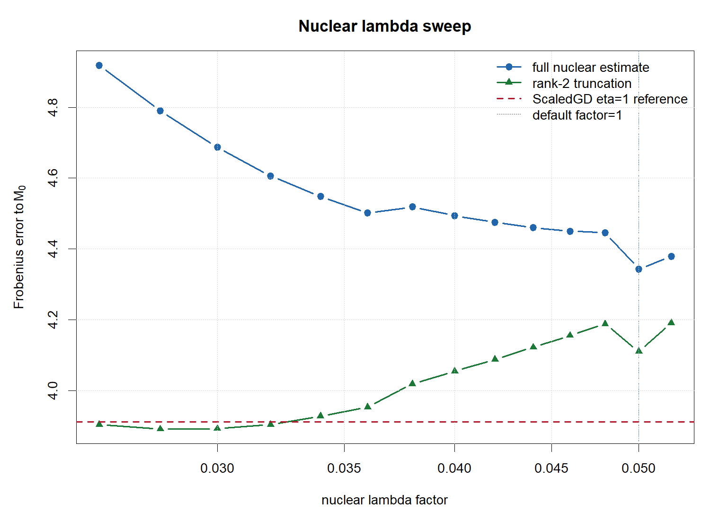
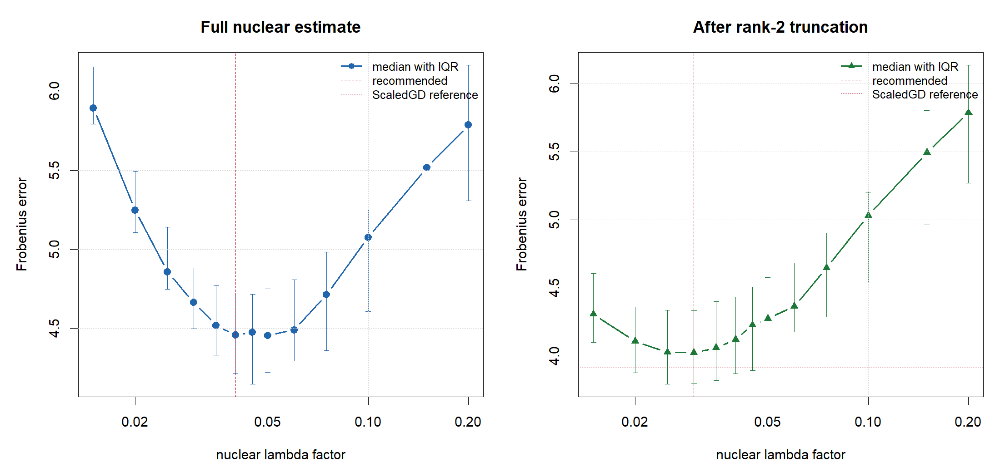
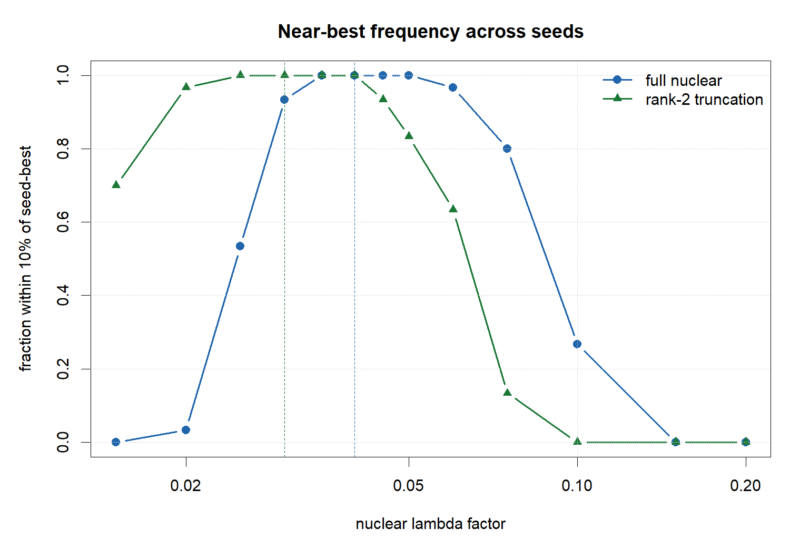
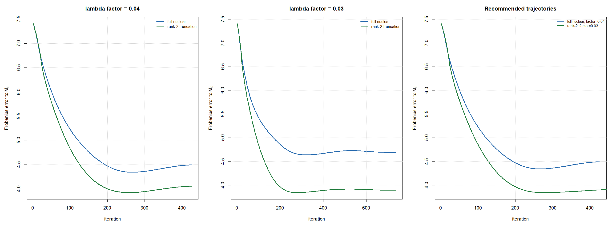
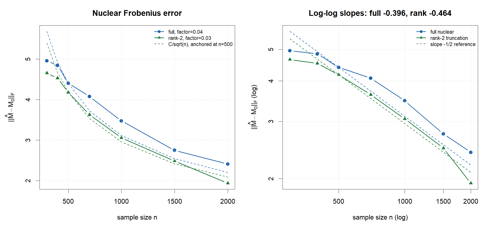

# Nuclear Norm Lambda Diagnostics

这个仓库整理了 nuclear-norm penalized estimator 在一个固定矩阵回归设置下的 lambda 选择与迭代表现诊断。

核心问题是：在 `p=30, q=25, n=500, cov-scale=0.2` 的设置下，默认 `lambda_factor=1` 的 nuclear estimator 最终 Frobenius error 在 7 附近；是否可以通过选择更合适的 lambda 改善结果？

## 项目结构

```text
scripts/
  test_nuclear_norm_initial_convergence.R
  test_nuclear_lambda_sweep_p30q25_covscale02.R
  test_nuclear_lambda_multiseed_p30q25_covscale02.R
  test_nuclear_recommended_lambda_iteration_paths.R
  test_nuclear_sample_size_rate_p30q25_covscale02.R

tables/
  nuclear_default_summary.csv
  nuclear_lambda_sweep_refined.csv
  nuclear_lambda_multiseed_aggregate.csv
  nuclear_lambda_recommendation_summary.txt
  nuclear_recommended_lambda_iteration_summary.csv
  nuclear_sample_size_rate_p30q25_covscale02.csv
  nuclear_sample_size_rate_summary.txt

figures/
  fig_nuclear_lambda_sweep_error.png
  fig_nuclear_lambda_multiseed_error_bands.png
  fig_nuclear_lambda_multiseed_near_best.png
  fig_nuclear_recommended_lambda_iteration_paths.png
  fig_nuclear_sample_size_rate.png

docs/
  lambda_selection_notes.md
  objective_vs_truth_frobenius.md
  sample_size_rate_notes.md

results/
  nuclear_norm_default/
  nuclear_lambda_sweep_refined/
  nuclear_lambda_multiseed/
  nuclear_recommended_lambda_iteration_paths/
  nuclear_sample_size_rate/
```

`results/` 保存原始输出，包括配置、CSV、PDF 和 PNG。`tables/` 是便于快速查看的核心汇总。

## 实验设置

固定设置为：

```text
p = 30
q = 25
rank = 2
n = 500
sigma = 0.5
signal = 6.0, 4.4
design = kronecker
rho_p = 0.8
rho_q = 0.7
cov-scale = 0.2
```

nuclear 惩罚参数写为：

```text
lambda = lambda_factor * sigma * sqrt((p + q) / n)
```

在这个设置下，

```text
sigma * sqrt((p + q) / n) = 0.16583124
```

因此默认 `lambda_factor=1` 对应 `lambda=0.16583124`。

## 主要结论

1. 默认 `lambda_factor=1` 明显偏大，nuclear 解被过度 shrinkage，估计 rank 只有 1。
2. 在单 seed 诊断中，默认 nuclear 的 Frobenius error 约为 `7.03`。
3. 将 `lambda_factor` 调小到 `0.04` 左右后，full nuclear estimator 的误差可以降到约 `4.45` 的量级。
4. 如果在 nuclear 解后做 rank-2 truncation，推荐 `lambda_factor=0.03`，多 seed median Frobenius error 约为 `4.02`。
5. 单个 seed 下，rank-2 truncation 的误差可以到 `3.89` 左右，已经接近同设置下 ScaledGD eta=1 的 `3.91`。
6. penalized objective 收敛不等价于真实 Frobenius error 最小；真实 error 的最小点可能早于 objective-change 停止点。
7. 固定推荐 lambda 因子并改变样本量时，rank-2 truncation 的 log-log 斜率约为 `-0.464`，比 full nuclear 的 `-0.396` 更接近 `1/sqrt(n)` 的 `-0.5` 参考斜率。

## 默认 lambda 的表现

默认 `lambda_factor=1` 的结果：

| lambda_factor | lambda | iter | converged | rank | F-error |
|---:|---:|---:|---|---:|---:|
| 1.0 | 0.165831 | 100 | TRUE | 1 | 7.027 |

这个结果说明默认 lambda 在当前 `cov-scale=0.2` 的设计强度下过大。

## 单 seed lambda sweep

在 `seed=20260527` 下，对 `lambda_factor=0.026` 到 `0.052` 做细网格 sweep：

| 用法 | 推荐 lambda_factor | lambda | F-error |
|---|---:|---:|---:|
| full nuclear estimator | 0.050 | 0.008292 | 4.343 |
| rank-2 truncation | 0.028 | 0.004643 | 3.891 |

图中蓝线是 full nuclear estimator，绿线是 rank-2 truncation，红色虚线是同设置下 ScaledGD eta=1 的参考误差 `3.91`。



## 多 seed 推荐 lambda

为了避免只对单个随机样本调参，进一步对 30 个 seed 做 sweep：

```text
seeds = 20260501, ..., 20260530
lambda_factor = 0.015, 0.02, 0.025, 0.03, 0.035, 0.04,
                0.045, 0.05, 0.06, 0.075, 0.1, 0.15, 0.2
```

多 seed 推荐结果：

| 用法 | 推荐 lambda_factor | lambda | mean F-error | median F-error | q75 F-error |
|---|---:|---:|---:|---:|---:|
| full nuclear estimator | 0.040 | 0.006633 | 4.455 | 4.456 | 4.723 |
| rank-2 truncation | 0.030 | 0.004975 | 4.077 | 4.025 | 4.334 |

所以在当前固定设置下，一个稳健经验选择是：

```text
full nuclear:       lambda_factor = 0.04
rank-2 truncation:  lambda_factor = 0.03
```



near-best 频率图显示：`lambda_factor` 在 `0.035` 到 `0.05` 对 full nuclear 都较稳定；rank-2 truncation 则更偏向 `0.025` 到 `0.035`。



## 推荐 lambda 下的迭代轨迹

使用同一数据集 `seed=20260527`，展示推荐 lambda 下 full nuclear 和 rank-2 truncation 的真实 Frobenius error 随迭代变化：

| lambda_factor | estimator | min F-error | min iter | final F-error | stop iter |
|---:|---|---:|---:|---:|---:|
| 0.04 | full nuclear | 4.342 | 267 | 4.494 | 427 |
| 0.04 | rank-2 truncation | 3.922 | 259 | 4.054 | 427 |
| 0.03 | full nuclear | 4.640 | 321 | 4.688 | 737 |
| 0.03 | rank-2 truncation | 3.843 | 279 | 3.892 | 737 |



这个图说明：算法按 penalized objective 停止时，真实 Frobenius error 不一定处在最低点。实际应用中无法使用真实 `M0` 来停止，但在 simulation 诊断中这个现象很重要。

## 样本量 rate 诊断

固定 `p=30, q=25, cov-scale=0.2`，沿用多 seed lambda sweep 给出的经验因子：

```text
full nuclear:       lambda_factor = 0.04
rank-2 truncation:  lambda_factor = 0.03
```

只改变样本量：

```text
n = 300, 400, 500, 700, 1000, 1500, 2000
```

结果如下：

| n | full iter | full F-error | full adjusted ratio | rank iter | rank-2 F-error | rank adjusted ratio |
|---:|---:|---:|---:|---:|---:|---:|
| 300 | 222 | 4.959 | 3.28 | 261 | 4.654 | 3.07 |
| 400 | 386 | 4.844 | 3.70 | 613 | 4.528 | 3.45 |
| 500 | 206 | 4.403 | 3.75 | 620 | 4.178 | 3.56 |
| 700 | 360 | 4.079 | 4.12 | 709 | 3.629 | 3.66 |
| 1000 | 362 | 3.476 | 4.19 | 816 | 3.056 | 3.69 |
| 1500 | 221 | 2.747 | 4.06 | 434 | 2.483 | 3.67 |
| 2000 | 652 | 2.410 | 4.11 | 887 | 1.935 | 3.30 |

对 `log(||Mhat-M0||_F)` 关于 `log(n)` 做线性拟合：

```text
full nuclear slope       = -0.396
rank-2 truncation slope  = -0.464
1/sqrt(n) reference      = -0.5
```



详细说明见 [`docs/sample_size_rate_notes.md`](docs/sample_size_rate_notes.md)。

## 复现命令

默认 nuclear 迭代诊断：

```powershell
Rscript scripts/test_nuclear_norm_initial_convergence.R `
  --p=30 `
  --q=25 `
  --sample-size=500 `
  --cov-scale=0.2 `
  --nuclear-lambda-factor=1 `
  --nuclear-maxit=300 `
  --reference-maxit=1000 `
  --out-root=results_reproduced/nuclear_norm_default
```

单 seed lambda sweep：

```powershell
Rscript scripts/test_nuclear_lambda_sweep_p30q25_covscale02.R `
  --out-root=results_reproduced/nuclear_lambda_sweep_refined
```

多 seed lambda sweep：

```powershell
Rscript scripts/test_nuclear_lambda_multiseed_p30q25_covscale02.R `
  --out-root=results_reproduced/nuclear_lambda_multiseed
```

推荐 lambda 下的迭代轨迹：

```powershell
Rscript scripts/test_nuclear_recommended_lambda_iteration_paths.R `
  --out-root=results_reproduced/nuclear_recommended_lambda_iteration_paths
```

样本量 rate 诊断：

```powershell
Rscript scripts/test_nuclear_sample_size_rate_p30q25_covscale02.R `
  --out-root=results_reproduced/nuclear_sample_size_rate
```

## 解释边界

这些推荐值是针对当前固定设置的经验诊断：

```text
p=30, q=25, n=500, cov-scale=0.2, sigma=0.5
```

不能直接当作所有维度、所有样本量或所有 covariance scaling 下的 universal lambda。更一般的选择规则还需要对 `n`、`p`、`q`、`cov-scale` 和噪声水平做系统 sweep。

## 参考文献

1. Emmanuel J. Candes and Benjamin Recht. Exact Matrix Completion via Convex Optimization. Foundations of Computational Mathematics, 2009.
2. Sahand Negahban and Martin J. Wainwright. Estimation of Near Low-Rank Matrices with Noise and High-Dimensional Scaling. Annals of Statistics, 2011.
3. Vladimir Koltchinskii, Karim Lounici, Alexandre B. Tsybakov. Nuclear-norm penalization and optimal rates for noisy low-rank matrix completion. Annals of Statistics, 2011.
